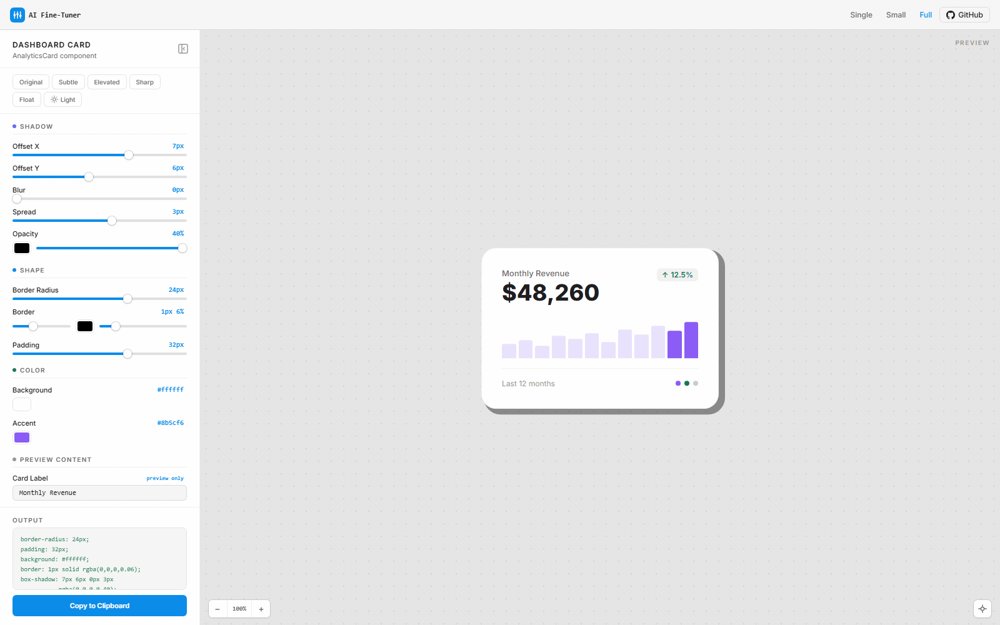

# AI Fine-Tuner

**Stop iterating in chat. Drag sliders instead.**



Shadows, animations, colors, typography, transforms, easing curves, SVG attributes — anything visual, with live preview. Every tuner is **bespoke** — built from YOUR element, YOUR parameters, on a production-grade template. The agent fills in the blanks, not the infrastructure. Any language, any stack, zero dependencies.

Works with Flutter, SwiftUI, React Native, CSS, Tailwind, SVG, JSON — or anything visual. The agent translates your element to a web preview, you drag sliders to get it right, and the output translates back to your language on copy. Not limited to software development — use it for any task where visual precision and interactive exploration matter.

Use it during a build to nail visual details the first time, or to replace the "make the shadow bigger… no, less… try 12px… actually 16…" iteration loop with a single HTML page with sliders and a **full infinite canvas**. Pinch-to-zoom on your trackpad, pan in any direction, see your **actual element** update in real-time at any zoom level, click **Copy to Clipboard**, paste into your code. Done.

No localhost. No build step. No external dependencies. Just a self-contained HTML file that opens in your browser via `file://` — with the same canvas interaction you'd expect from Figma or a native design tool.

Works with **Claude Code** · **OpenAI Codex** · **Cursor** · **Windsurf** · **Cline** · **Aider** · **Copilot** · **bolt.new** · **Lovable** · **Replit Agent** — and any agent that reads `AGENTS.md`.

## How It Workswhat else is 

```
You:   " /ai-fine-tuner the shadow on this card"
            |
Agent: "I'll generate a tuner for CardWidget with controls for
        shadow offset, blur, spread, color. I need to read
        src/components/Card.tsx. Proceed?"
            |
You:   "yes"
            |
Agent: generates tuner → saves to .fine-tune/card-shadow/
       → opens it in your browser automatically
            |
Agent: "Opened fine-tune-card-shadow.html in your browser.
        Full path: /Users/you/project/.fine-tune/card-shadow/fine-tune-card-shadow.html

        Drag the sliders to find your perfect values, then click
        'Copy to Clipboard' and paste the result back here —
        I'll apply them to your code."
            |
You:   drag sliders on infinite canvas → see YOUR card update live
            |
       click "Copy to Clipboard"
            |
       paste back → agent applies to your code
```

The agent reads your real source file, reproduces your actual element with its real styles/fonts/text in the preview, and gives you framework-ready output (CSS, Tailwind, Flutter, SwiftUI, React Native, or JSON).

## 60% Fewer Tokens Per Tuning Session

Without AI Fine-Tuner, a typical shadow-tweaking session looks like:

```
You:    "make the shadow bigger"           ~200 tokens
Agent:  applies changes                    ~500 tokens
You:    "too much, try 12px blur"          ~200 tokens
Agent:  applies changes                    ~500 tokens
You:    "add some spread"                  ~200 tokens
Agent:  applies changes                    ~500 tokens
You:    "the color should be softer"       ~200 tokens
Agent:  applies changes                    ~500 tokens
...repeat 5-10 more times...
                                    Total: ~6,000-10,000 tokens
```

With AI Fine-Tuner:

```
You:    "fine-tune the shadow"             ~200 tokens
Agent:  reads file, generates tuner        ~3,000 tokens
You:    drag sliders in browser            0 tokens
You:    "apply these values: [paste]"      ~300 tokens
Agent:  applies                            ~400 tokens
                                    Total: ~3,900 tokens
```

One round-trip instead of ten. Perfect values because you can see them live. Zero guessing.

## Install

> **Templates are bundled with the skill** — install once (globally or per-project) and they're available in every repo. No need to copy assets into each project. The agent reads templates from the install location, generates a tuner HTML file, and saves it to `.fine-tune/` in your working directory.

---

### Claude Code — Plugin (recommended)

The fastest way. Works in CLI, VS Code, and JetBrains — one install, everywhere.

```bash
# Install from GitHub (one-step)
claude plugin install ai-fine-tuner@https://github.com/muhamadjawdatsalemalakoum/aifinetuner.git

# Or two-step (equivalent — useful if you want to inspect the marketplace first)
claude plugin marketplace add muhamadjawdatsalemalakoum/aifinetuner
claude plugin install ai-fine-tuner@aifinetuner

# Or load from a local clone (for development/testing)
git clone https://github.com/muhamadjawdatsalemalakoum/aifinetuner.git
claude --plugin-dir ./aifinetuner
```

**Manage plugins:**
```bash
claude plugin enable ai-fine-tuner    # enable
claude plugin disable ai-fine-tuner   # disable without uninstalling
claude plugin update ai-fine-tuner    # update to latest
claude plugin uninstall ai-fine-tuner # remove
```

Use `/plugin` in any Claude Code session to manage installed plugins (enable, disable, update).

> The plugin bundles the skill, templates, and AGENTS.md in one package. The `plugin.json` manifest auto-discovers all components — no manual file copying needed.

### Claude Code — Skill (manual)

If you prefer installing as a standalone skill instead of a plugin:

```bash
git clone https://github.com/muhamadjawdatsalemalakoum/aifinetuner.git
cd ai-fine-tuner
./install-claude.sh
```

The installer copies the skill + templates + AGENTS.md to `~/.claude/skills/ai-fine-tuner/` (global) or `.claude/skills/ai-fine-tuner/` (project).

**Manual install:**
```bash
# Global (all projects)
mkdir -p ~/.claude/skills/ai-fine-tuner/{assets/templates,references}
cp skills/ai-fine-tuner/SKILL.md ~/.claude/skills/ai-fine-tuner/
cp assets/templates/*.html ~/.claude/skills/ai-fine-tuner/assets/templates/
cp AGENTS.md ~/.claude/skills/ai-fine-tuner/references/

# Project-only
mkdir -p .claude/skills/ai-fine-tuner/{assets/templates,references}
cp skills/ai-fine-tuner/SKILL.md .claude/skills/ai-fine-tuner/
cp assets/templates/*.html .claude/skills/ai-fine-tuner/assets/templates/
cp AGENTS.md .claude/skills/ai-fine-tuner/references/
```

### Claude Code — VS Code & JetBrains

The IDE extensions use the same skill directory as the CLI. Install via CLI (above) and it works in your IDE automatically. Skills are invoked the same way — type `/ai-fine-tuner` in the Claude Code panel.

### Claude Desktop (GUI)

1. Open **Customize > Skills** in the sidebar
2. Click **+** then **Upload a skill**
3. Upload a ZIP of the `skills/ai-fine-tuner/` folder (include `assets/templates/` inside)
4. Enable **Code execution** in **Settings > Capabilities**
5. The skill appears in the `/` menu — Claude selects it automatically when relevant

> To create the ZIP: `zip -r ai-fine-tuner.zip skills/ai-fine-tuner/ assets/templates/ AGENTS.md` (run from the repo root)

### Claude Desktop — Cowork Plugins

1. Open the **Cowork** tab, click **Customize** in the sidebar
2. Click **Browse plugins** and search for "AI Fine-Tuner"
3. Click **Install** — the plugin bundles the skill, templates, and AGENTS.md

---

### OpenAI Codex

```bash
git clone https://github.com/muhamadjawdatsalemalakoum/aifinetuner.git
cd ai-fine-tuner
./install-codex.sh
```

**Manual install:**
```bash
# Project — AGENTS.md + templates
cp AGENTS.md /path/to/your/project/
mkdir -p /path/to/your/project/.fine-tune/templates
cp assets/templates/*.html /path/to/your/project/.fine-tune/templates/
# Global
cat AGENTS.md >> ~/.codex/AGENTS.override.md
mkdir -p ~/.codex/ai-fine-tuner/templates
cp assets/templates/*.html ~/.codex/ai-fine-tuner/templates/
```

> The Codex Desktop App shares the same `~/.codex/` directory as the CLI — install once via CLI and it works in both.

---

### Cursor

```bash
./install-cursor.sh
```

Offers two methods: drop `AGENTS.md` in project root (Cursor auto-discovers it) or install to `.cursor/rules/`. Templates go to `.fine-tune/templates/`.

### Windsurf

```bash
./install-windsurf.sh
```

Offers: `AGENTS.md` in project root or `.windsurf/rules/`. Windsurf reads both automatically.

### Cline

```bash
./install-cline.sh
```

Offers: `AGENTS.md` in project root, `.clinerules/`, or global (`~/Documents/Cline/Rules/`). Cline auto-detects all formats including `.cursorrules` and `.windsurfrules`.

### Aider

```bash
./install-aider.sh
```

Copies `AGENTS.md` and auto-configures `.aider.conf.yml` so Aider reads it on startup.

### Any Other Agent

Copy `AGENTS.md` and templates to your project:

```bash
cp AGENTS.md /path/to/your/project/
cp -r assets/templates /path/to/your/project/.fine-tune/templates
```

Templates are optional — the agent can generate from the spec in AGENTS.md if not found. `AGENTS.md` follows the [Agent Skills](https://agentskills.io) open standard adopted by 20+ tools including GitHub Copilot, Google Jules, Gemini CLI, Devin, and others. See `agents/generic.md` for per-agent details.

## Demos

**[Live demo site](https://muhamadjawdatsalemalakoum.github.io/aifinetuner/)** — try all three templates in your browser right now.

Three working samples are included in `samples/` — open any of them locally to experience the infinite canvas, trackpad zoom/pan, and live preview before installing anything.

| Demo | Template | Controls | Try it |
|------|----------|----------|--------|
| **Button Shadow** | `single.html` | 1 slider + 4 presets (Flat, Subtle, Medium, Deep) | [`samples/single-button-glow.html`](samples/single-button-glow.html) |
| **Pricing Card** | `small.html` | 3 sliders (border radius, shadow blur, accent color) | [`samples/small-pricing-card.html`](samples/small-pricing-card.html) |
| **Dashboard Card** | `full.html` | 12 sliders across shadow, shape, and color groups | [`samples/full-dashboard-card.html`](samples/full-dashboard-card.html) |
| **Animation Preview** | `full.html` | 8+ sliders for typography, gradient, glow, keyframe animation | [`samples/full-animation-preview.html`](samples/full-animation-preview.html) |

## Infinite Canvas Preview

Every template ships with a Figma-quality infinite canvas — not a static preview box, but a full spatial workspace with native trackpad and mouse support.

### Trackpad & Mouse

| Gesture | Action |
|---------|--------|
| **Two-finger pinch** | Zoom toward cursor (25% – 400%), smooth and continuous |
| **Two-finger scroll** | Pan in any direction — the dot-grid background moves with the element |
| **Ctrl + scroll wheel** | Zoom with a mouse (same 25% – 400% range) |
| **Double-click canvas** | Reset to 100% zoom, centered |

### Canvas HUD

A floating heads-up display in the bottom-left corner shows the current zoom level with **+/−** buttons for precise stepping. The zoom percentage updates live as you pinch.

### Dark / Light Toggle

Switch the canvas background between a light dot-grid and a dark variant. Your element stays identical — only the surrounding canvas changes, so you can check contrast in both contexts.

### Editable Value Inputs

Every numeric readout next to a slider is a **clickable input field**. Click any value to type an exact number directly instead of dragging. Hit Enter or click away to apply — the preview updates instantly.

### Collapsible Controls

The control panel (bottom bar, bottom panel, or sidebar depending on template tier) collapses with one click. When collapsed, the canvas fills the full viewport with a small tab to re-expand. All transitions are GPU-accelerated (`transform` + `will-change`) — no jank, no reflow.

## Template Tiers

Three pre-built HTML templates — the agent picks the right one automatically and only fills in your element, slider values, and the update function. Everything else comes built-in.

| Sliders | Template | Layout |
|---------|----------|--------|
| 1 | `single.html` | Infinite canvas + bottom bar with one slider, presets, collapse toggle |
| 2-4 | `small.html` | Infinite canvas + bottom panel grid of sliders with collapse toggle |
| 5+ | `full.html` | Collapsible sidebar with grouped sliders + infinite canvas |

**Every template includes — for free, with zero agent effort:**

- Infinite canvas with pinch-to-zoom (25% – 400%) and two-finger pan
- Dot-grid background that scrolls with the element
- Zoom HUD with live percentage and +/− buttons
- Double-click-to-reset canvas view
- Dark/light canvas toggle
- Editable numeric value inputs (click any readout to type exact values)
- GPU-accelerated collapsible controls (`transform` + `will-change`)
- One-click "Copy to Clipboard" with customizable label
- Preset buttons for common value combinations
- Optional controls and CTA — the AI can generate canvas-only previews when tuning isn't needed
- Self-contained HTML — works via `file://`, no server needed

## Key Principles

**Authentic Preview** — The preview is a pixel-faithful reproduction of your real element. The agent reads your source file, resolves all CSS variables / Tailwind classes / design tokens to concrete values, and reproduces actual markup, fonts, text, and icons. No placeholders.

**Confirm Before Spending** — Generating a tuner is token-heavy (file reads + full HTML generation). The agent always summarizes what it will do and asks before proceeding.

**Works During Builds Too** — Not just for tweaking existing elements. When the agent builds a new component, it can offer a fine-tuner so you nail the visual details (shadows, spacing, colors) before moving on. The element just needs to exist in some form — even if it was created moments ago.

**Instructed Suggestions** — AGENTS.md instructs the agent to suggest the fine-tuner after visual iterations or vague feedback. However, explicit invocation via `/ai-fine-tuner` is the most reliable trigger.

**Token-Efficient** — Pre-built templates mean the agent spends tokens only on your element and values, not on designing slider UI from scratch.

## Integration Depth

Not all platforms support the same features. Here's what you get at each level:

| Feature | Claude Code | Codex | Cursor | Windsurf / Cline / Aider |
|---------|------------|-------|--------|--------------------------|
| Explicit triggers ("fine-tune this") | Skill match | AGENTS.md | AGENTS.md / Rules | AGENTS.md |
| Proactive after visual iterations | Skill body | AGENTS.md | AGENTS.md | AGENTS.md |
| Plugin install | `claude plugin install` | Manual | Manual | Manual |
| Confirm before generating | Skill body | AGENTS.md | AGENTS.md | AGENTS.md |
| Apply values exactly | Skill body | AGENTS.md | AGENTS.md | AGENTS.md |

The fine-tuner is invoked explicitly via `/ai-fine-tuner` or when the agent matches the skill description. Proactive suggestions depend on the agent following AGENTS.md instructions.

## Advanced Capabilities

### Persistent Storage & Cross-Session Reuse

Every tuner is saved to `.fine-tune/[element]-[property]/` with both the HTML file and a `context.md` that tracks what was tuned, where, and when. On re-tune, the agent finds the existing tuner, regenerates the HTML from your current source (so the preview is never stale), and opens it. You can also reopen any tuner's HTML yourself, readjust, copy decisions, and paste them into a new agent session — the clipboard header tells the agent exactly what to update.

### Multi-State Tuning

A single tuner can handle hover, focus, active, light/dark mode, and expanded/collapsed states using toggle controls. Flip a checkbox to see your element's hover shadow vs. its base shadow, side by side in the same preview.

### Compound Tuning

Tune multiple related elements in one preview — a card and its inner button, a navbar and its dropdown. Controls are grouped per element so you can see how the pieces look together.

### Proactive Text Fields

The agent adds text input fields to the preview even if you didn't ask — button labels, card titles, sample text — so you can test how different content lengths affect the design. These update the preview in real-time but aren't included in the copied output (they're preview helpers, not style values).

## Supported Output Formats

| Framework | Output Format |
|---|---|
| CSS | `border-radius: 12px; box-shadow: 0 8px 24px rgba(0,0,0,0.15);` |
| Tailwind CSS | `rounded-xl shadow-lg bg-[#1a1a2e]` |
| Flutter | `BorderRadius.circular(12), BoxShadow(...)` |
| SwiftUI | `.cornerRadius(12) .shadow(...)` |
| React Native | `borderRadius: 12, shadowOffset: {...}` |
| JSON | `{ "borderRadius": 12, ... }` |

The agent detects your framework from file extensions and package files, or you can tell it explicitly.

## Project Structure

```
ai-fine-tuner/
|
|-- install-claude.sh              # One-command Claude Code installer
|-- install-codex.sh               # One-command Codex installer
|-- install-cursor.sh              # One-command Cursor installer
|-- install-windsurf.sh            # One-command Windsurf installer
|-- install-cline.sh               # One-command Cline installer
|-- install-aider.sh               # One-command Aider installer
|-- install-utils.sh               # Shared installer utilities (sourced by all installers)
|
|-- .claude-plugin/
|   +-- plugin.json                # Claude Plugin manifest
|
|-- skills/
|   +-- ai-fine-tuner/
|       +-- SKILL.md               # Claude Code skill definition
|
|-- AGENTS.md                      # Universal spec (any agent)
|
|-- agents/
|   |-- codex.md                   # OpenAI Codex setup guide
|   |-- cursor.md                  # Cursor setup guide
|   +-- generic.md                 # Windsurf, Cline, Aider, etc.
|
|-- assets/
|   +-- templates/
|       |-- single.html            # 1 slider — infinite canvas + bottom bar
|       |-- small.html             # 2-4 sliders — infinite canvas + bottom panel
|       +-- full.html              # 5+ sliders — collapsible sidebar + infinite canvas
|
|-- samples/
|   |-- index.html               # GitHub Pages landing site
|   |-- single-button-glow.html  # Demo: 1-slider button shadow
|   |-- small-pricing-card.html  # Demo: 3-slider pricing card
|   +-- full-dashboard-card.html # Demo: 12-slider dashboard
|
|-- README.md
+-- LICENSE
```

## When It Activates

**Explicit invocation by platform:**

| Platform | Command |
|----------|---------|
| Claude Code (CLI / VS Code / JetBrains) | `/ai-fine-tuner` |
| OpenAI Codex | `$ai-fine-tuner` |
| Cursor | `/ai-fine-tuner` |
| Windsurf | `@ai-fine-tuner` |
| Cline | `/ai-fine-tuner` |
| Aider | `/read AGENTS.md` then ask to fine-tune |

**Instructed** — AGENTS.md tells the agent to suggest it when:
- You've been going back and forth on visual values (2+ rounds)
- You give vague visual feedback ("make it pop", "the spacing feels off")
- The agent wants to show visual options instead of describing them in text

> Note: instructed suggestions depend on the agent following AGENTS.md. Explicit invocation via `/ai-fine-tuner` is always the most reliable trigger.

## Contributing

Contributions welcome. Some areas that could use help:

- **More agent integrations** — Dedicated setup guides for agents not yet covered
- **Animation tuning** — Play/pause, easing curve visualization, timeline scrubber
- **Multi-element** — A/B comparison, hover state + base state side by side
- **Tailwind intelligence** — Prefer standard classes (`rounded-xl`) over arbitrary values (`rounded-[12px]`) when possible
- **More presets** — Domain-specific preset packs (e-commerce cards, dashboards, landing pages)

## Created By

**Muhamad Jawdat Salem Alakoum**

- **[LinkedIn](https://www.linkedin.com/in/muhamad-jawdat-salem-alakoum-a79742bb/)** — Connect with me
- **[YottoCode](https://yottocode.com)** — My Claude Code Telegram connector. A Mac app with a monthly subscription — download it, try it, let me know what you think.
- **[Ancient Prayers](https://ancientprayers.bandcamp.com)** — My music. Listen, share, buy if it moves you.

## License

**Source Available** — free to use as an AI agent skill or plugin. Commercial redistribution or competing products prohibited. See [LICENSE](LICENSE) for full terms.
